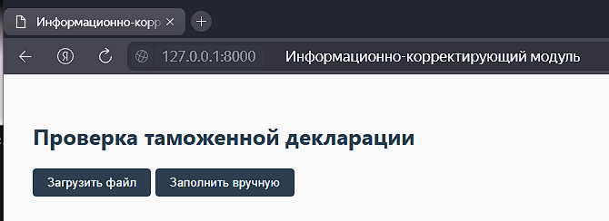
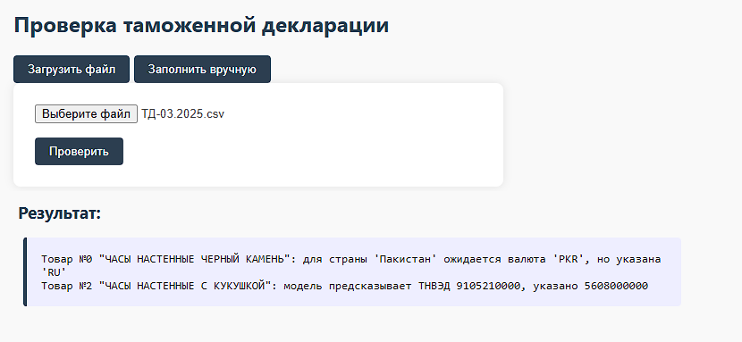
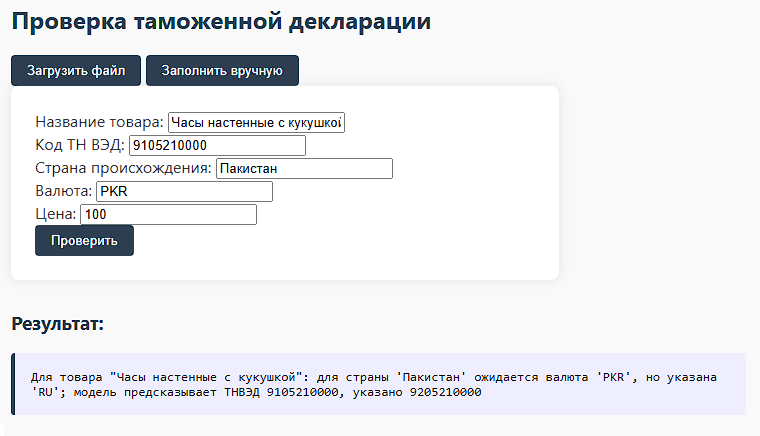

# Информационно-корректирующий модуль (ИКМ) для предварительной проверки таможенных деклараций

Веб-сервис на Python, предназначенный для интеллектуальной предварительной проверки товарных описаний в таможенных декларациях. Использует методы машинного обучения для предсказания кодов ТН ВЭД, выявления аномалий и логических несоответствий в данных.

## 🔧 Основной функционал

- Предобработка данных из загружаемых деклараций (CSV)
- Предсказание кодов ТН ВЭД по описанию товара
- Валидация структуры и логики декларации
- Обработка ошибок и выдача рекомендаций
- Поддержка ручного ввода и загрузки файла
- Возврат результатов с метками ошибок и предполагаемыми исправлениями

## 💻 Интерфейс

- Web-интерфейс на FastAPI + HTML (Jinja2)
- Поддержка загрузки CSV-деклараций
- Поддержка ручного ввода товарных описаний
- JSON API для интеграции с внешними системами

## 🧠 Технологии и стек

- **Python 3.10+**
- **FastAPI** — для построения веб-сервиса
- **pandas** — для обработки табличных данных
- **scikit-learn** — обучение и инференс ML-модели
- **joblib** — сериализация модели
- **TF-IDF + Random Forest** — векторизация текста и классификация

## 🧪 Результаты

- Точность классификации на синтетическом датасете: **92%**
- Учитываются "сложные" ошибки (семантический анализ)
- Гибкая архитектура позволяет доработку и масштабирование

## 📦 Установка и запуск

```bash
git clone https://github.com/your-username/customs-ikm.git
cd customs-ikm
pip install -r requirements.txt
uvicorn app.main:app --reload
````

Доступ к веб-интерфейсу: [http://localhost:8000](http://localhost:8000)

## 📄 Структура проекта

```
├── app/
│   ├── main.py           # FastAPI entrypoint
│   ├── model_utils.py    # Загрузка и использование ML-модели
│   ├── logic.py          # Валидации и проверки
│   └── templates/        # HTML-шаблоны
├── model/
│   └── classifier.joblib # Обученная модель
├── data/
│   └── sample.csv        # Пример декларации
└── requirements.txt
```

## 🔧 Пример использования

1. Откройте веб-интерфейс и загрузите CSV-файл с товарами.
2. Получите таблицу с предполагаемыми кодами ТН ВЭД и выявленными ошибками.
3. При необходимости скорректируйте данные и повторите проверку.

## 🔮 Перспективы развития

* Интеграция с базами ФТС (через API)
* Подключение к справочникам кодов, валют, единиц измерения
* Поддержка XML-формата (по структуре ЕАЭС)
* Механизм очередей и асинхронной обработки больших файлов
* Авторизация и разграничение прав (инспектор / декларант)

## 📸 Скриншоты

### Главный экран


### Проверка загруженного файла


### Проверка ручного заполнения


## 📧 Контакты

Автор: Ханнанова Эвелина Руслановна
Email: [evelinkah@yandex.ru](mailto:evelinkah@yandex.ru)

## 📝 Лицензия

Проект создан в рамках выпускной квалификационной работы и может быть использован как pet-проект.
